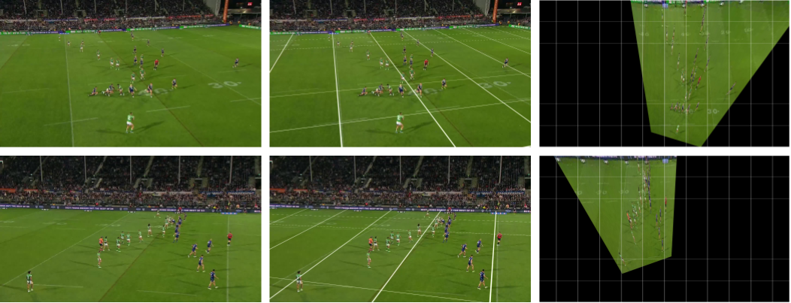

# Vote Based Line Aggregation (VBLA) For Sports Field Registration



### To run:
To run for results you will need a directory containing frames of a rugby league game. For best results ensure your clip includes a large portion of the field over the clips entirety.

> [!WARNING]
> Clips which contain static features such as overlayed scoreboards will often cause errors with the image stitching and should be preprocessed before registration.

#### Clone repository
```
git clone https://github.com/Stephen-Hallett/VBLA.git
cd VBLA
```

#### Install dependencies
```
pip install -r requirements.txt
```

#### Run registration script
```
python registration.py PATH_TO_FRAMES
```